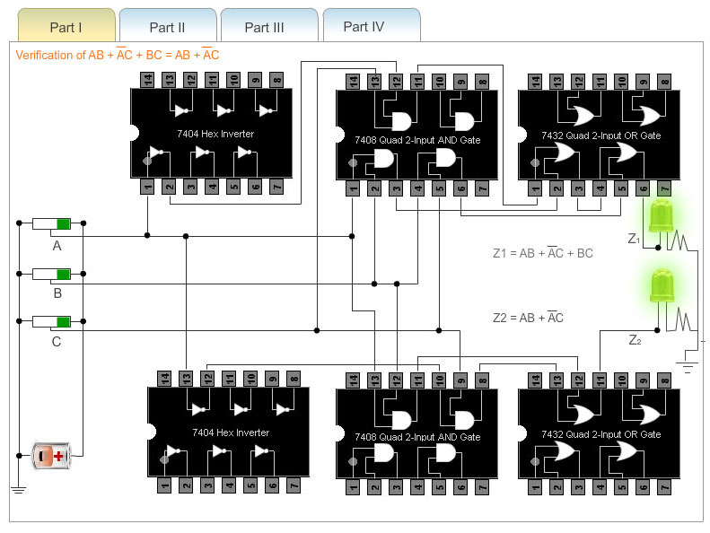
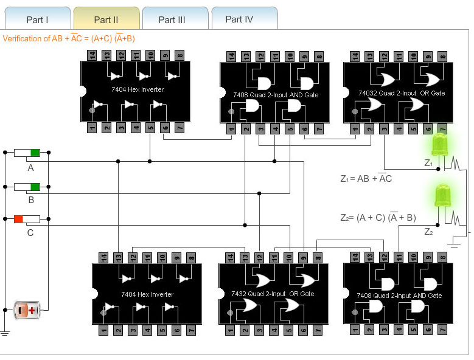
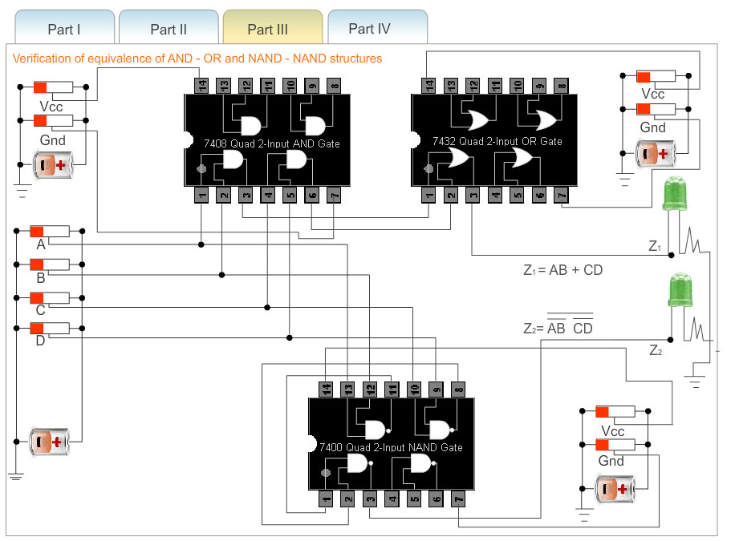
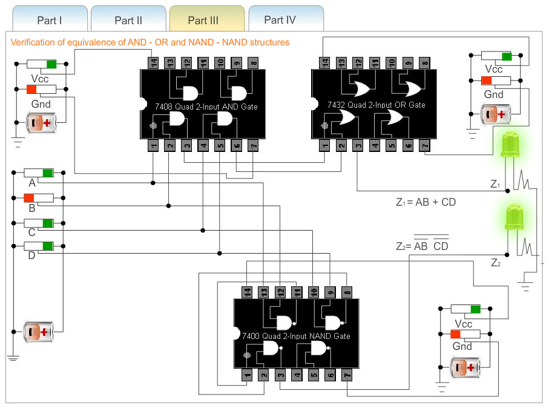
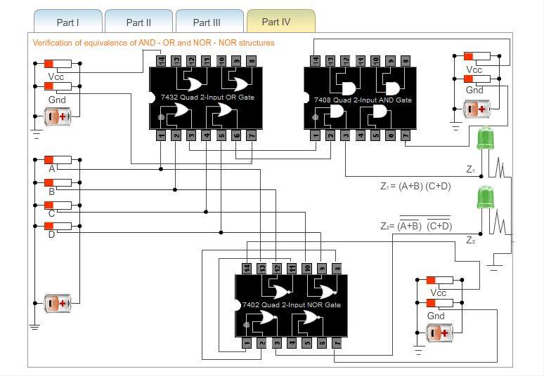
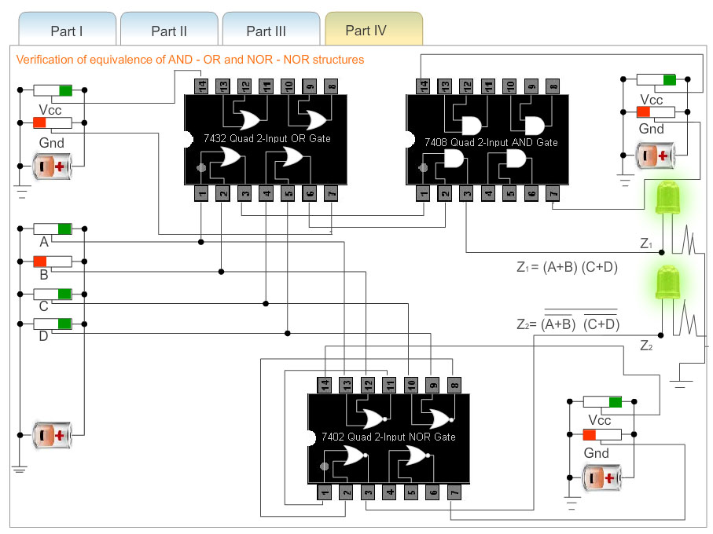

### Procedure

 
                            
                            

Please follow these steps to do the experiment.

                             
                             
                            
 
Part 1:

                         
<ol>
                            
 <li class="expt1">At first go through the structure of 7404 Hex inverter, 7408(quad 2-input AND gates), 7432(quad 2-input OR gates). </li>
                            	<li class="expt1">Next, apply a high level voltage to all the inputs A,B,C.</li>
                                <li class="expt1">Next,  check that both LEDs glow. This is because both the outputs z1 and z2 attain the
                                same value.</li>
                                <li class="expt1">Thus, AB+AC+BC=AB+AC holds for the condition A=B=C="1".</li>
				<li class="expt1">	For all the combinations of the variables A,B, and C verify that both the LEDs are glowing 
                                or not glowing. If the LED glows, it indicates that the corresponding output has reached logic 1 level. Similarly
                                a dark LED indicates low level output voltage.</li>
                                </ol>
                                 
                              
                                
                                
 
Part 2:

                                
 <ol>
                                
<li class="expt1">	At first go through the structure of 7400(quad 2-input NAND gates), 7408(quad 2-input AND gates), 7432(quad 2-input OR gates).</li>
                                
 <li class="expt1">	Next, apply a high level voltage to  inputs A,B.and apply low level voltage to the input C.</li>
                                <li class="expt1">	Next,  check that both LEDs glow. This is because both the outputs z1 and z2 attain the
                                same value.</li>
                                <li class="expt1">	So, the equivalence of AND-OR and NAND NAND structure can be verified.</li>
                                 
  <li class="expt1">	For all the combinations of the variables A,B and C verify that both the LEDs are glowing 
                                or not glowing. If the LED glows, it indicates that the corresponding output has reached logic 1 level. Similarly
                                a dark LED indicates low level output voltage.</li>
                               
                                
                               
                            
</ol>
                            
 
                            

Part 3:

                                
<ol>
                                
<li class="expt1">	At first go through the structure of 7404 Hex inverter, 7408(quad 2-input AND gates), 7432(quad 2-input OR gates), 7400(quad 2-input NAND gates).</li>
                                <li class="expt1">	Next, apply a high level voltage to all the Vcc inputs and keep low level voltage to all the  Gnd inputs.If Vcc and ground are not connected properly then error message will be appeared and no output will be generated.</li>
                                <li class="expt1">	Next, apply a high level voltage to  the inputs A,B and apply low level voltage to the input C.</li>
                                <li class="expt1">	Next,  check that both LEDs glow.This is because both the outputs z1 and z2 attain the
                                same value.</li>
                                <li class="expt1">	Thus, AB+AC+BC=AB+AC =(A+C)(A+B) holds for the condition A=B="1"  and C=D="0"</li>
                               
                               
 <li class="expt1">	For all the combinations of the variables A,B and C verify that both the LEDs are glowing 
                                or not glowing. If the LED glows, it indicates that the corresponding output has reached logic 1 level. Similarly
                                a dark LED indicates low level output voltage</li>                            
                               
                            
 </ol>
                 
                 
                 
                 
                
 
Part 4:

                                
<ol>
                                
<li class="expt1">	At first go through the structure of 7402(quad 2-input NOR gates), 7408(quad 2-input AND gates), 7432(quad 2-input OR gates).</li>
                                <li class="expt1">	Next, apply a high level voltage to all the Vcc inputs and apply low level voltage to all the  Gnd inputs.If Vcc and ground are not connected properly then error message will be appeared and no output will be generated.</li>
                                <li class="expt1">	Next, apply a high level voltage to all the inputs A,C  and apply low level voltage to the inputs B,D.</li>
                                <li class="expt1">	Next,  check that both LEDs glow.This is because both the outputs z1 and z2 attain the
                                same value.</li>
                                <li class="expt1">	So, the equivalence of OR-AND and NOR-NOR structure can be verified. </li>
                                
<li class="expt1">	For all the combinations of the variables A,B,C  and D verify that both the LEDs are glowing 
                                or not glowing. If the LED glows, it indicates that the corresponding output has reached logic 1 level. Similarly
                                a dark LED indicates low level output voltage.</li>
                                 </ol>
                
 
                 
                 
                 
                      
                        
