### Theory 

                           

<!-- Write the section content inside a paragraph element, we can also include images with &lt;img&gt; tag -->

                            
                            Analysis of Logic gates using 7400(quad 2-input NAND gates),7402(quad 2-input NOR gates),
7404(HEX inverter),7408(quad 2-input AND gates),7432(quad 2-input OR gates). Diagrams of each chip are shown in Figure 
                             
    

		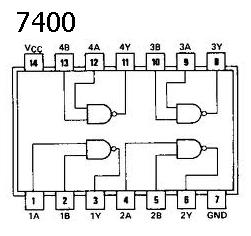
                              
                             Figure 1
                              
                             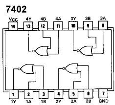
                              
                             Figure 2
                              
                              
                             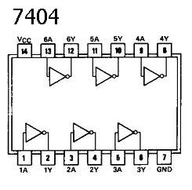
                              
                             Figure 3
                               
                              
                             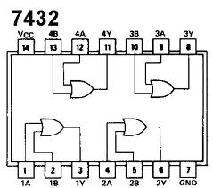
                              
                             Figure 4
                              
                             Fig: 1 . 7400(quad 2 input NAND gates)&nbsp;Fig: 2 . 7402 (quad 2 input NOR gates)
                               
                             Fig: 3 . 7404(HEX inverter)&nbsp;Fig: 4 . 7432(quad 2-input OR gates)
                              
                             
                                

 

                             
                            
 
(a) AB+AC+BC=AB+AC

                           

 According to consensus theorem,the Boolean identity holds.

                            
                           
                           
                            
 

                            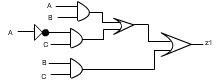
                            &nbsp;&nbsp;
                            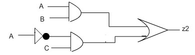
                             
                           
In the above picture both circuits are equivalent.

                            
                           

(b) AB+AC=(A+C)(A+B)
 
                             
 
 According to consensus theorem,the Boolean identity holds.

                            
                           
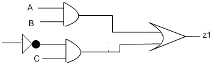
                              &nbsp;&nbsp;
                            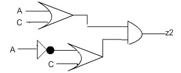 
                              
                             
In the above picture both circuits are equivalent.

                              
                              
(c)Verify eqivalence of AND-OR and NAND-NAND structure
 
                              
                              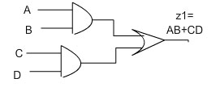
                              &nbsp;&nbsp;
                            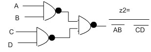
                             
                            
In the above picture both circuits are equivalent.

                              
                            
(d)Verify eqivalence of OR-AND and NOR-NOR structure

                            
 
                            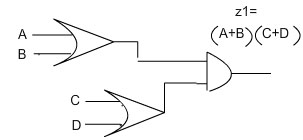
                              &nbsp;&nbsp;
                            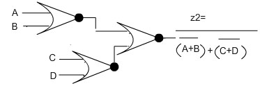
                              
                            
In the above picture both circuits are equivalent.

                               
                             

                            
                            
  
                            Student may be asked to wire up the network of gates shown in the above figures.
                            They can next verify that the output of the two circuits,viz z1 and z2 should 
                            attain the same value for each of the eight possible input combinations assigned 
                            to the variables A,B,C,and D. 
                          
                              
                        
